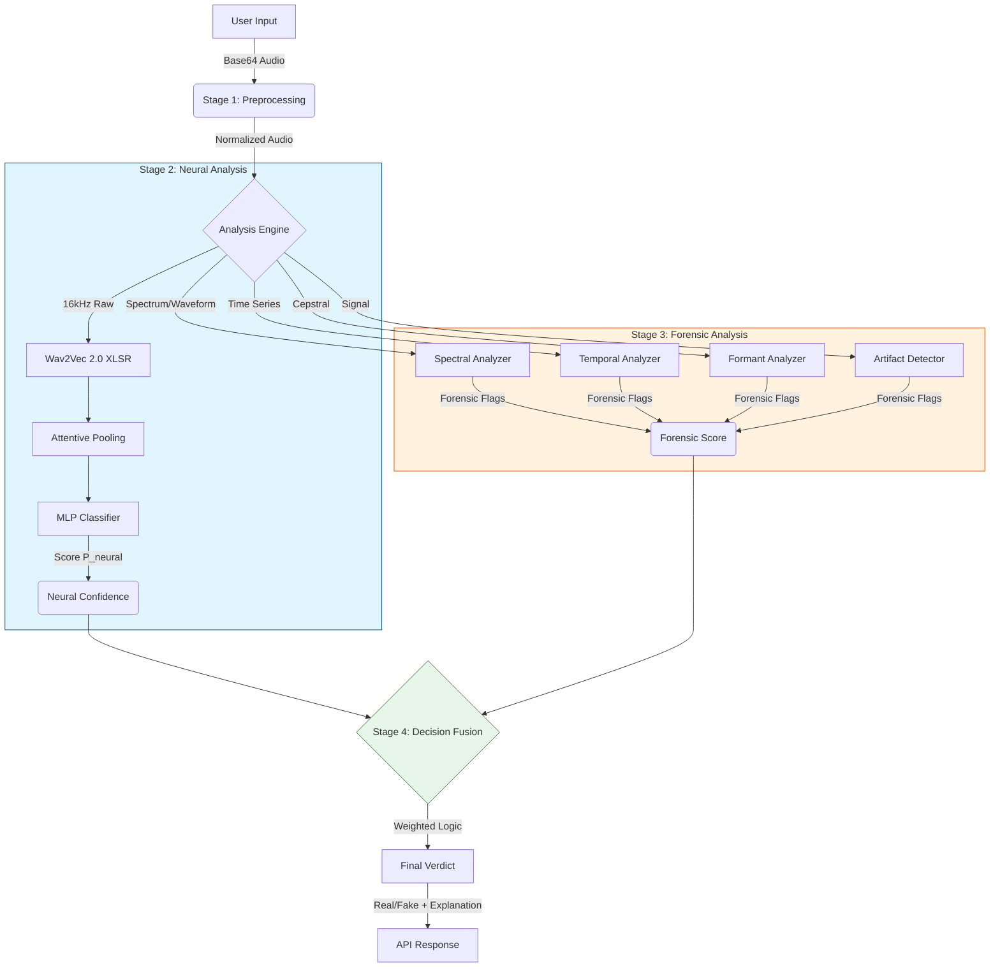

# VoiceGuard Architecture & Technical Approach

## 1. System Overview
VoiceGuard is a hybrid AI voice detection system designed to identify synthetic (deepfake) speech with high precision. Unlike traditional classifiers that rely solely on a single neural network, VoiceGuard employs a **Multi-Stage Fusion Architecture**. This approach combines the pattern-recognition capabilities of deep learning with the rigorous, explainable checks of signal processing forensics.

The system is built on **FastAPI** for high-performance, asynchronous request processing, making it suitable for real-time applications.

### 📊 Workflow Diagram

---

## 2. Architectural Pipeline

The detection pipeline consists of four distinct stages, executed sequentially for every API request:

### Stage 1: Preprocessing & Normalization
Before analysis, raw audio inputs (Base64 encoded) undergo strict normalization ensures consistency across different recording environments.
*   **Decoding**: Converts Base64 to raw bytes.
*   **Resampling**: All audio is resampled to **16kHz**, the native sampling rate of the backbone model (Wav2Vec 2.0).
*   **Mono Conversion**: Stereo channels are mixed down to mono.
*   **Silence Trimming**: Leading/trailing silence is removed to focus analysis on active speech.
*   **Peak Normalization**: Amplitude is scaled to avoid clipping while preserving dynamic range.

### Stage 2: Neural Analysis Engine (The "Brain")
The core classifier is a deep learning model fine-tuned for fake speech detection.
*   **Backbone**: **Wav2Vec 2.0 (XLSR-53)**. This large-scale pre-trained model excels at learning cross-lingual speech representations, making the system robust across different languages (English, Hindi, Tamil, etc.).
*   **Feature Extraction**: The backbone outputs a sequence of context-aware vectors representing 25ms audio frames.
*   **Pooling Mechanism**: **Attentive Statistics Pooling**. Instead of simple averaging, this layer learns *which* frames are most important for detection (e.g., glottal anomalies) and computes a weighted mean and standard deviation.
*   **Classification Head**: A dense Multi-Layer Perceptron (MLP) projects the pooled features into a probability score ($P(AI)$).
*   **Segmentation Strategy**: The system splits long audio into 5-second overlapping segments, analyzes each independently, and aggregates the scores. This prevents short deepfake clips from being "hidden" inside long real recordings.

### Stage 3: Forensic Analysis Engine (The "Sherlock Holmes")
Parallel to the neural model, a suite of signal processing algorithms scans for specific artifacts that generative models often fail to reproduce perfectly.

#### A. Spectral Analyzer (Frequency Domain)
*   **Spectral Flatness**: AI models often produce "too perfect" spectra. We detect unnaturally low variance in spectral flatness.
*   **Bandwidth Consistency**: Human speech varies in bandwidth; vocoders often generate fixed-bandwidth signals.
*   **High-Frequency Cutoffs**: Detects sharp drop-offs > 14kHz, a common signature of older upsampling vocoders.

#### B. Temporal Analyzer (Time Domain)
*   **Energy Dynamics**: Natural speech has "micro-jitter" in amplitude. AI speech often has unnaturally smooth energy envelopes.
*   **Pause Analysis**: Detects "metronomic" breathing patterns—pauses that are perfectly spaced (e.g., exactly 0.5s), which is rare in natural speech.

#### C. Formant Analyzer (Voice Box Physics)
*   **Vocal Tract Modeling**: Uses MFCCs (Mel-Frequency Cepstral Coefficients) to approximate the shape of the vocal tract.
*   **Transition Smoothness**: Deepfakes often have "slurred" or overly smooth transitions between phonemes compared to the rapid, complex muscle movements of a human speaker.

#### D. Artifact Detector
*   **Phase Discontinuities**: Detects "clicks" or "pops" caused by bad concatenation in TTS systems.
*   **Digital Silence**: Checks for "absolute zero" silence (digital 0), which never occurs in real-world microphone recordings.

### Stage 4: Decision Fusion
The final verdict is not just an average. It is a **Weighted Logical Fusion**:
1.  **Confidence Weighting**: The Neural Model contributes 75% of the baseline score, while Forensics contribute 25%.
2.  **Agreement Boosting**: If *both* the Neural Model and Forensics Engine agree (e.g., both say "Fake"), the confidence score is boosted (pushed closer to 0 or 1).
3.  **Conflict Resolution**: If they disagree (e.g., Neural says "Fake" but Forensics find no artifacts), the confidence is penalized, and the system outputs a lower-certainty score, flagging it for review.

---

## 3. Technology Stack

### Core Frameworks
*   **Python 3.9+**: Primary language.
*   **FastAPI**: Web server framework (Chosen for async speed).
*   **PyTorch**: Deep learning inference engine.
*   **Transformers (Hugging Face)**: Model architecture management.
*   **Librosa / Scipy**: DSP (Digital Signal Processing) libraries for forensics.

### Deployment
*   **Docker**: Containerized for portability.
*   **Uvicorn**: ASGI server production deployment.
*   **Hugging Face Spaces**: Hosting platform for the demo.

---

## 4. Key Advantages
1.  **Explainability**: Unlike "black box" AI models, VoiceGuard tells you *why* it flagged a clip (e.g., "Metronomic pause timing detected").
2.  **Robustness**: The forensic layer catches "adversarial samples" that might trick the neural model.
3.  **Language Agnostic**: By using Wav2Vec 2.0 XLSR, the system focuses on *acoustic* signatures of synthesis, not linguistic content, making it effective for any language.
